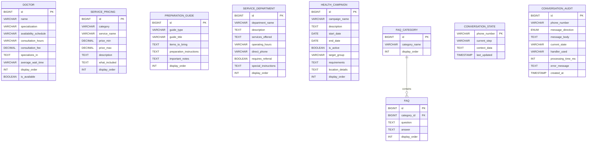

# Southview Medical Centre - WhatsApp Chatbot Architecture
## Digital Front Desk Information Bot

---

## Executive Summary

**Problem:** 90% of patient calls are repetitive questions that exhaust staff (200+ calls/day).

**Solution:** 24/7 WhatsApp information bot providing instant answers to common questions.

**Architecture:** Simple, production-ready information dissemination system using Handler Pattern and enum-based state management.

**Timeline:** 4 days for MVP covering 90% of repetitive questions.

**Tech Stack:** Spring Boot 3.2 + MySQL 8.0 + Twilio WhatsApp API + Java 17

---

## Table of Contents

1. [System Architecture](#system-architecture)
2. [Database Schema](#database-schema)
3. [State Management](#state-management)
4. [Handler Pattern](#handler-pattern)
5. [Configuration Management](#configuration-management)
6. [Feature Modules](#feature-modules)
7. [Production Components](#production-components)
8. [Implementation Roadmap](#implementation-roadmap)

---

## System Architecture

### High-Level Flow


### Architecture Layers

```
┌─────────────────────────────────────────────────────────────┐
│                    PRESENTATION LAYER                       │
│  ┌────────────────────────────────────────────────────┐   │
│  │  WhatsAppController                                │   │
│  │  - Receives Twilio webhooks                        │   │
│  │  - Validates requests                              │   │
│  │  - Returns TwiML responses                         │   │
│  └────────────────────────────────────────────────────┘   │
└───────────────────────┬─────────────────────────────────────┘
                        │
┌───────────────────────▼─────────────────────────────────────┐
│                    HANDLER LAYER                            │
│  ┌────────────────────────────────────────────────────┐   │
│  │  HandlerDispatcher                                 │   │
│  │  - Finds handler for current state                 │   │
│  │  - Delegates processing                            │   │
│  └────────────────────────────────────────────────────┘   │
│                                                             │
│  ┌──────────┐ ┌──────────┐ ┌──────────┐ ┌──────────┐    │
│  │ MainMenu │ │ Hospital │ │ Doctor   │ │ Price    │    │
│  │ Handler  │ │ Info     │ │ Handler  │ │ Handler  │    │
│  └──────────┘ └──────────┘ └──────────┘ └──────────┘    │
│                                                             │
│  ┌──────────┐ ┌──────────┐ ┌──────────┐ ┌──────────┐    │
│  │Insurance │ │Preparation││Directions│ │ Services │    │
│  │ Handler  │ │ Handler  │ │ Handler  │ │ Handler  │    │
│  └──────────┘ └──────────┘ └──────────┘ └──────────┘    │
└───────────────────────┬─────────────────────────────────────┘
                        │
┌───────────────────────▼─────────────────────────────────────┐
│                    SERVICE LAYER                            │
│  ┌────────────────┐ ┌────────────────┐ ┌────────────────┐ │
│  │ConversationSvc │ │ DoctorService  │ │ PriceService   │ │
│  │MessageFormatter│ │ HospitalService│ │ CampaignService│ │
│  │ AuditService   │ │ FAQService     │ │ TwiMLBuilder   │ │
│  └────────────────┘ └────────────────┘ └────────────────┘ │
└───────────────────────┬─────────────────────────────────────┘
                        │
┌───────────────────────▼─────────────────────────────────────┐
│                  REPOSITORY LAYER                           │
│  (Spring Data JPA Interfaces)                              │
│  - ConversationStateRepository                             │
│  - DoctorRepository                                        │
│  - ServicePricingRepository                                │
│  - PreparationGuideRepository                              │
│  - ServiceDepartmentRepository                             │
│  - HealthCampaignRepository                                │
│  - FAQRepository, FAQCategoryRepository                    │
│  - ConversationAuditRepository                             │
└───────────────────────┬─────────────────────────────────────┘
                        │
┌───────────────────────▼─────────────────────────────────────┐
│                   DATABASE LAYER                            │
│                     MySQL 8.0                               │
│  8 simple tables, no complex relationships                 │
│  Payment/Insurance/Hospital info in application.yml        │
└─────────────────────────────────────────────────────────────┘
```

---

## Database Schema

### Simple Schema (8 Tables - Ultra Minimal!)



**Key Design Decisions:**
- ✅ Hospital info (name, address, hours) in `application.yml` - not in database
- ✅ Payment methods in config - static list, no table needed
- ✅ Insurance providers in config - rarely change
- ✅ All tables are standalone (except FAQ → FAQ_CATEGORY)
- ✅ No complex joins required
- ✅ Simple queries = fast responses

```sql
-- Note: Hospital info (name, address, hours, etc.) in application.yml config

-- 1. DOCTOR (Doctors with schedules)
CREATE TABLE doctor (
    id BIGINT PRIMARY KEY AUTO_INCREMENT,
    name VARCHAR(255) NOT NULL,
    specialization VARCHAR(255),           -- GP, Obstetrician, Pediatrician
    availability_schedule VARCHAR(255),    -- "Mon, Wed, Fri"
    consultation_hours VARCHAR(100),       -- "8:30 AM - 4:00 PM"
    consultation_fee DECIMAL(10,2),
    specializes_in TEXT,                   -- Bullet list of specializations
    average_wait_time VARCHAR(50),         -- "30-45 minutes"
    display_order INT NOT NULL,
    is_available BOOLEAN DEFAULT TRUE,
    INDEX idx_display_order (display_order),
    INDEX idx_available (is_available)
);

-- 3. SERVICE_PRICING (Services with prices)
CREATE TABLE service_pricing (
    id BIGINT PRIMARY KEY AUTO_INCREMENT,
    category VARCHAR(100) NOT NULL,        -- Consultations, Lab, Radiology, Maternity
    service_name VARCHAR(255) NOT NULL,
    price_min DECIMAL(10,2),
    price_max DECIMAL(10,2),               -- For ranges (e.g., $400-$800)
    description TEXT,
    what_included TEXT,                    -- What's included in price
    display_order INT NOT NULL,
    INDEX idx_category (category),
    INDEX idx_display_order (display_order)
);

-- Note: Payment methods & insurance info in application.yml (config file)

-- 4. PREPARATION_GUIDE (What to bring for different services)
CREATE TABLE preparation_guide (
    id BIGINT PRIMARY KEY AUTO_INCREMENT,
    guide_type VARCHAR(100) NOT NULL,      -- Maternity, Lab Tests, Radiology
    guide_title VARCHAR(255),
    items_to_bring TEXT,                   -- Checklist of items
    preparation_instructions TEXT,         -- How to prepare (fasting, water, etc.)
    important_notes TEXT,                  -- Warnings, tips
    display_order INT NOT NULL,
    INDEX idx_display_order (display_order)
);

-- 5. SERVICE_DEPARTMENT (Pharmacy, Lab, etc.)
CREATE TABLE service_department (
    id BIGINT PRIMARY KEY AUTO_INCREMENT,
    department_name VARCHAR(255) NOT NULL, -- Pharmacy, Laboratory, Radiology
    description TEXT,
    services_offered TEXT,                 -- Bullet list
    operating_hours VARCHAR(255),
    direct_phone VARCHAR(20),
    requires_referral BOOLEAN DEFAULT FALSE,
    special_instructions TEXT,
    display_order INT NOT NULL,
    INDEX idx_display_order (display_order)
);

-- 6. HEALTH_CAMPAIGN (Active promotions/campaigns)
CREATE TABLE health_campaign (
    id BIGINT PRIMARY KEY AUTO_INCREMENT,
    campaign_name VARCHAR(255) NOT NULL,
    description TEXT,
    start_date DATE NOT NULL,
    end_date DATE NOT NULL,
    is_active BOOLEAN DEFAULT TRUE,
    target_group VARCHAR(255),             -- "Children under 5", "Pregnant women"
    requirements TEXT,
    location_details TEXT,
    display_order INT NOT NULL,
    INDEX idx_active_dates (is_active, start_date, end_date),
    INDEX idx_display_order (display_order)
);

-- 7. FAQ_CATEGORY (FAQ categories)
CREATE TABLE faq_category (
    id BIGINT PRIMARY KEY AUTO_INCREMENT,
    category_name VARCHAR(100) NOT NULL UNIQUE,
    display_order INT NOT NULL,
    INDEX idx_display_order (display_order)
);

-- 8. FAQ (Frequently asked questions)
CREATE TABLE faq (
    id BIGINT PRIMARY KEY AUTO_INCREMENT,
    category_id BIGINT NOT NULL,
    question TEXT NOT NULL,
    answer TEXT NOT NULL,
    display_order INT NOT NULL,
    FOREIGN KEY (category_id) REFERENCES faq_category(id) ON DELETE CASCADE,
    INDEX idx_category_order (category_id, display_order)
);

-- 9. CONVERSATION_STATE (Active user sessions)
CREATE TABLE conversation_state (
    phone_number VARCHAR(20) PRIMARY KEY,
    current_step VARCHAR(50) NOT NULL,     -- Enum as string
    context_data TEXT,                      -- JSON for complex state
    last_updated TIMESTAMP DEFAULT CURRENT_TIMESTAMP ON UPDATE CURRENT_TIMESTAMP,
    INDEX idx_last_updated (last_updated)
);

-- CONVERSATION_AUDIT (Activity logging - optional but recommended)
CREATE TABLE conversation_audit (
    id BIGINT PRIMARY KEY AUTO_INCREMENT,
    phone_number VARCHAR(20) NOT NULL,
    message_direction ENUM('INCOMING', 'OUTGOING') NOT NULL,
    message_body TEXT,
    current_state VARCHAR(50),
    handler_used VARCHAR(100),
    processing_time_ms INT,
    error_message TEXT,
    created_at TIMESTAMP DEFAULT CURRENT_TIMESTAMP,
    INDEX idx_phone_created (phone_number, created_at),
    INDEX idx_created (created_at)
);
```

**Total: 8 tables** (7 for features + 1 for audit)

**Relationships:** Simple, mostly standalone tables. No complex joins.

**Note:** Hospital info, payment methods & insurance providers are in `application.yml` config file (not database tables).
This keeps the MVP ultra-simple - static information doesn't need database overhead.

---

## State Management

### ConversationStep Enum

```java
package com.banda.hospital_chatbot.enums;

/**
 * State machine for conversation flow
 * Simple 15-state navigation (no booking complexity)
 */
public enum ConversationStep {
    // Main entry point
    MAIN_MENU,

    // Feature 1: Hospital Information
    HOSPITAL_INFO,

    // Feature 2: Doctor Directory
    DOCTOR_LIST,
    DOCTOR_DETAIL,              // context: doctor_id

    // Feature 3: Service Pricing
    PRICE_CATEGORIES,
    PRICE_DETAIL,               // context: category

    // Feature 4: Insurance & Payment
    INSURANCE_INFO,

    // Feature 5: Preparation Guides
    PREPARATION_CATEGORIES,
    PREPARATION_DETAIL,         // context: guide_id

    // Feature 6: Directions & Transport
    DIRECTIONS,

    // Feature 7: Service Departments
    SERVICE_LIST,
    SERVICE_DETAIL,             // context: department_id

    // Feature 8: Health Campaigns
    CAMPAIGN_LIST,
    CAMPAIGN_DETAIL,            // context: campaign_id

    // Feature 9: Lab Results Inquiry
    LAB_RESULTS_INQUIRY,

    // Feature 10: Emergency Contact
    EMERGENCY_CONTACT,

    // FAQ System (already working)
    FAQ_CATEGORIES,
    FAQ_QUESTIONS;              // context: category_id

    /**
     * Get parent state for "back" navigation
     */
    public ConversationStep getParentState() {
        return switch(this) {
            case DOCTOR_DETAIL -> DOCTOR_LIST;
            case PRICE_DETAIL -> PRICE_CATEGORIES;
            case PREPARATION_DETAIL -> PREPARATION_CATEGORIES;
            case SERVICE_DETAIL -> SERVICE_LIST;
            case CAMPAIGN_DETAIL -> CAMPAIGN_LIST;
            case FAQ_QUESTIONS -> FAQ_CATEGORIES;
            case DOCTOR_LIST, PRICE_CATEGORIES, INSURANCE_INFO,
                 PREPARATION_CATEGORIES, DIRECTIONS, SERVICE_LIST,
                 CAMPAIGN_LIST, LAB_RESULTS_INQUIRY, EMERGENCY_CONTACT,
                 FAQ_CATEGORIES, HOSPITAL_INFO -> MAIN_MENU;
            default -> MAIN_MENU;
        };
    }

    /**
     * Check if state requires context data
     */
    public boolean requiresContext() {
        return this == DOCTOR_DETAIL
            || this == PRICE_DETAIL
            || this == PREPARATION_DETAIL
            || this == SERVICE_DETAIL
            || this == CAMPAIGN_DETAIL
            || this == FAQ_QUESTIONS;
    }
}
```

### ConversationState Entity

```java
package com.banda.hospital_chatbot.entity;

import jakarta.persistence.*;
import lombok.*;
import java.time.LocalDateTime;

@Entity
@Table(name = "conversation_state")
@Data
@NoArgsConstructor
@AllArgsConstructor
public class ConversationState {

    @Id
    @Column(name = "phone_number")
    private String phoneNumber;

    @Enumerated(EnumType.STRING)
    @Column(name = "current_step", nullable = false)
    private ConversationStep currentStep;

    @Column(name = "context_data", columnDefinition = "TEXT")
    private String contextData;  // JSON string for complex state

    @Column(name = "last_updated")
    private LocalDateTime lastUpdated;

    @PrePersist
    @PreUpdate
    protected void onUpdate() {
        this.lastUpdated = LocalDateTime.now();
    }
}
```

---

## Handler Pattern

### Core Interfaces

```java
package com.banda.hospital_chatbot.handler;

/**
 * Base interface for all message handlers
 */
public interface MessageHandler {
    /**
     * Check if this handler can process the current state
     */
    boolean canHandle(ConversationStep step);

    /**
     * Process user input and return response
     */
    HandlerResponse handle(HandlerRequest request);

    /**
     * Get the state this handler manages
     */
    ConversationStep getHandledStep();
}
```

```java
package com.banda.hospital_chatbot.handler;

import lombok.*;

@Data
@Builder
public class HandlerRequest {
    private String phoneNumber;
    private String userInput;
    private Integer parsedChoice;      // Pre-parsed numeric input
    private ConversationStep currentStep;
    private String contextData;        // JSON context
}

@Data
@Builder
public class HandlerResponse {
    private String message;            // Response text
    private ConversationStep nextStep; // Next state
    private String contextData;        // Updated context
    private boolean clearContext;      // Clear context on transition
}
```

### Handler Dispatcher

```java
package com.banda.hospital_chatbot.handler;

import org.springframework.stereotype.Service;
import java.util.List;

@Service
public class MessageHandlerDispatcher {

    private final List<MessageHandler> handlers;
    private final MessageHandler fallbackHandler;

    public MessageHandlerDispatcher(List<MessageHandler> handlers,
                                   FallbackMessageHandler fallbackHandler) {
        this.handlers = handlers;
        this.fallbackHandler = fallbackHandler;
    }

    /**
     * Find and invoke appropriate handler
     */
    public HandlerResponse dispatch(HandlerRequest request) {
        return handlers.stream()
            .filter(handler -> handler.canHandle(request.getCurrentStep()))
            .findFirst()
            .orElse(fallbackHandler)
            .handle(request);
    }
}
```

### Example Handler Implementation

```java
package com.banda.hospital_chatbot.handler;

import org.springframework.stereotype.Component;
import lombok.RequiredArgsConstructor;

@Component
@RequiredArgsConstructor
public class DoctorListHandler implements MessageHandler {

    private final DoctorService doctorService;
    private final MessageFormatterService formatter;

    @Override
    public boolean canHandle(ConversationStep step) {
        return step == ConversationStep.DOCTOR_LIST;
    }

    @Override
    public HandlerResponse handle(HandlerRequest request) {
        Integer choice = request.getParsedChoice();

        // Back to main menu
        if (choice != null && choice == 0) {
            return HandlerResponse.builder()
                .message(formatter.getMainMenu())
                .nextStep(ConversationStep.MAIN_MENU)
                .clearContext(true)
                .build();
        }

        // Select doctor by choice
        Doctor doctor = doctorService.getDoctorByMenuPosition(choice);

        if (doctor == null) {
            return HandlerResponse.builder()
                .message(formatter.formatError(
                    "Invalid selection. Please choose 1-" + doctorService.getDoctorCount(),
                    doctorService.formatDoctorList()
                ))
                .nextStep(ConversationStep.DOCTOR_LIST)
                .build();
        }

        // Show doctor details
        String context = String.format("{\"doctor_id\":%d}", doctor.getId());

        return HandlerResponse.builder()
            .message(doctorService.formatDoctorDetail(doctor))
            .nextStep(ConversationStep.DOCTOR_DETAIL)
            .contextData(context)
            .build();
    }

    @Override
    public ConversationStep getHandledStep() {
        return ConversationStep.DOCTOR_LIST;
    }
}
```

### Main Controller (Skeleton)

```java
package com.banda.hospital_chatbot.controller;

import org.springframework.web.bind.annotation.*;
import org.springframework.http.*;
import lombok.RequiredArgsConstructor;

@RestController
@RequestMapping("/webhook")
@RequiredArgsConstructor
public class WhatsAppWebhookController {

    private final MessageHandlerDispatcher dispatcher;
    private final ConversationStateService stateService;
    private final TwiMLResponseBuilder twimlBuilder;
    private final ValidationService validationService;
    private final AuditService auditService;

    @PostMapping(value = "/whatsapp", produces = MediaType.APPLICATION_XML_VALUE)
    public ResponseEntity<String> handleIncomingMessage(
            @RequestParam("From") String from,
            @RequestParam("Body") String body) {

        long startTime = System.currentTimeMillis();

        try {
            // 1. Validate & sanitize input
            String phoneNumber = validationService.sanitizePhoneNumber(from);
            String userInput = validationService.sanitizeInput(body);

            // 2. Get current conversation state
            ConversationStep currentStep = stateService.getState(phoneNumber);
            String contextData = stateService.getContext(phoneNumber);

            // 3. Parse numeric input
            Integer parsedChoice = parseChoice(userInput);

            // 4. Build handler request
            HandlerRequest request = HandlerRequest.builder()
                .phoneNumber(phoneNumber)
                .userInput(userInput)
                .parsedChoice(parsedChoice)
                .currentStep(currentStep)
                .contextData(contextData)
                .build();

            // 5. Dispatch to handler
            HandlerResponse response = dispatcher.dispatch(request);

            // 6. Update conversation state
            if (response.isClearContext()) {
                stateService.setState(phoneNumber, response.getNextStep());
            } else {
                stateService.setState(phoneNumber, response.getNextStep(),
                    response.getContextData());
            }

            // 7. Log activity (async)
            long duration = System.currentTimeMillis() - startTime;
            auditService.logConversation(phoneNumber, userInput,
                response.getMessage(), currentStep, response.getNextStep(), duration);

            // 8. Build TwiML response
            String twiml = twimlBuilder.buildTextResponse(response.getMessage());

            return ResponseEntity.ok()
                .contentType(MediaType.APPLICATION_XML)
                .body(twiml);

        } catch (Exception e) {
            // Global error handling
            String errorResponse = twimlBuilder.buildTextResponse(
                "⚠️ System error. Please try again or call +263 4 123 4567"
            );
            return ResponseEntity.ok()
                .contentType(MediaType.APPLICATION_XML)
                .body(errorResponse);
        }
    }

    private Integer parseChoice(String input) {
        if (input == null) return null;
        try {
            return Integer.parseInt(input.trim());
        } catch (NumberFormatException e) {
            return null;
        }
    }
}
```

---

## Configuration Management

### Application Configuration (application.yml)

**Purpose:** Store rarely-changing reference data in config file instead of database tables.

**Why Config File for Insurance & Payment Methods:**
- ✅ Simpler for MVP (no extra tables)
- ✅ Faster to build (4-day timeline)
- ✅ Easy to update (edit YAML, redeploy)
- ✅ Insurance providers rarely change (CIMAS, PSMAS are established)
- ✅ Payment methods are fixed (Cash, EcoCash, Visa)
- ✅ Phase 2: Migrate to database when admin panel is built

```yaml
# src/main/resources/application.yml

hospital:
  # Basic Information
  name: Southview Medical Centre
  address: '123 Borrowdale Road, Harare, Zimbabwe'
  main-phone: '+263 4 123 4567'
  email: 'info@southviewmedical.co.zw'

  operating-hours: |
    Mon-Fri: 8:00 AM - 5:00 PM
    Saturday: 8:00 AM - 1:00 PM
    Sunday & Public Holidays: CLOSED

  parking-info: 'FREE parking available on-site'

  transport-routes: |
    Kombi Route 4: CBD → Borrowdale
    Get off at OK Supermarket stop
    Walk 2 minutes (we're next door)

  google-maps-link: 'https://goo.gl/maps/example'

  # Emergency Contact Numbers
  emergency:
    primary-line: '+263 4 999 1234'
    ambulance-line: '+263 4 999 5678'
    instructions: 'Call primary line for all emergencies. Ambulance will be dispatched if needed.'

  # Payment Methods Accepted
  payment-methods:
    - code: CASH_USD
      name: 'Cash (USD)'
      emoji: 💵
      active: true

    - code: CASH_ZWL
      name: 'Cash (ZWL)'
      emoji: 💵
      info: 'Current exchange rate applied'
      active: true

    - code: ECOCASH
      name: EcoCash
      emoji: 📱
      info: 'Send to: 0771234567'
      active: true

    - code: ONEMONEY
      name: OneMoney
      emoji: 📱
      info: 'Send to: 0783456789'
      active: true

    - code: VISA
      name: Visa/Mastercard
      emoji: 💳
      info: 'Chip & PIN or contactless'
      active: true

    - code: SWIPE
      name: 'Swipe (Local Cards)'
      emoji: 💳
      info: 'All major local banks accepted'
      active: true

  # Insurance Providers
  insurance:
    accepted:
      - name: CIMAS
        full-name: 'CIMAS Medical Aid Society'
        notes: 'Comprehensive cover including chronic medication and maternity'
        requirements: 'Valid CIMAS card + ID document'

      - name: PSMAS
        full-name: 'Premier Service Medical Aid Society'
        notes: 'Government employee medical aid - check your benefit limits'
        requirements: 'Valid PSMAS card + ID + referral (if required)'

      - name: 'Premier Medical Aid'
        full-name: 'Premier Medical Aid'
        notes: 'Private medical aid with good hospital coverage'
        requirements: 'Valid card + ID document'

    not-accepted:
      - name: 'First Mutual Health (FMH)'
        reason: 'Currently working on partnership'

      - name: 'Strategies Medical Aid'
        reason: 'Not currently accepted'
```

### Configuration Class

```java
package com.banda.hospital_chatbot.config;

import org.springframework.boot.context.properties.ConfigurationProperties;
import org.springframework.stereotype.Component;
import lombok.Data;
import java.util.List;

@Component
@ConfigurationProperties(prefix = "hospital")
@Data
public class HospitalConfig {

    // Basic hospital information
    private String name;
    private String address;
    private String mainPhone;
    private String email;
    private String operatingHours;
    private String parkingInfo;
    private String transportRoutes;
    private String googleMapsLink;

    // Emergency contact
    private EmergencyConfig emergency;

    // Payment & insurance
    private List<PaymentMethodConfig> paymentMethods;
    private InsuranceConfig insurance;

    @Data
    public static class EmergencyConfig {
        private String primaryLine;
        private String ambulanceLine;
        private String instructions;
    }

    @Data
    public static class PaymentMethodConfig {
        private String code;
        private String name;
        private String emoji;
        private String info;
        private boolean active;
    }

    @Data
    public static class InsuranceConfig {
        private List<InsuranceProviderConfig> accepted;
        private List<InsuranceProviderConfig> notAccepted;
    }

    @Data
    public static class InsuranceProviderConfig {
        private String name;
        private String fullName;
        private String notes;
        private String requirements;
        private String reason;  // For not-accepted
    }
}
```

### Usage in Services

```java
@Service
@RequiredArgsConstructor
public class InsuranceInfoService {

    private final HospitalConfig config;

    public String formatInsuranceAndPaymentInfo() {
        StringBuilder sb = new StringBuilder();
        sb.append("💳 *Insurance & Payment*\n\n");

        // Medical Aid Accepted
        sb.append("Medical Aid Accepted:\n");
        for (var provider : config.getInsurance().getAccepted()) {
            sb.append("✅ ").append(provider.getName()).append("\n");
            if (provider.getNotes() != null) {
                sb.append("   ℹ️ ").append(provider.getNotes()).append("\n");
            }
        }

        // Not Accepted
        if (!config.getInsurance().getNotAccepted().isEmpty()) {
            sb.append("\n❌ Not Currently Accepted:\n");
            for (var provider : config.getInsurance().getNotAccepted()) {
                sb.append("   ").append(provider.getName()).append("\n");
            }
        }

        // Payment Methods
        sb.append("\n💰 Payment Methods:\n");
        for (var method : config.getPaymentMethods()) {
            if (method.isActive()) {
                sb.append(method.getEmoji()).append(" ")
                  .append(method.getName()).append("\n");
                if (method.getInfo() != null) {
                    sb.append("   ℹ️ ").append(method.getInfo()).append("\n");
                }
            }
        }

        sb.append("\n0️⃣ Back to Main Menu");
        return sb.toString();
    }
}
```

---

## Feature Modules

### Feature 1: Hospital Information Hub

**Handler:** `HospitalInfoHandler`
**State:** `HOSPITAL_INFO`
**Data Source:** `application.yml` (HospitalConfig)

**Response Format:**
```
🏥 *Southview Medical Centre*

📍 Location:
123 Borrowdale Road, Harare

⏰ Operating Hours:
Mon-Fri: 8:00 AM - 5:00 PM
Saturday: 8:00 AM - 1:00 PM
Sunday: CLOSED

📞 Main: +263 4 123 4567
📧 info@southviewmedical.co.zw

🅿️ FREE parking available
🚌 Kombi Route 4 (CBD-Borrowdale)

0️⃣ Back to Main Menu
```

**Implementation:**
```java
@Component
@RequiredArgsConstructor
public class HospitalInfoHandler implements MessageHandler {

    private final HospitalConfig config;

    @Override
    public HandlerResponse handle(HandlerRequest request) {
        String message = String.format("""
            🏥 *%s*

            📍 Location:
            %s

            ⏰ Operating Hours:
            %s

            📞 Main: %s
            📧 %s

            🅿️ %s
            🚌 %s

            0️⃣ Back to Main Menu
            """,
            config.getName(),
            config.getAddress(),
            config.getOperatingHours(),
            config.getMainPhone(),
            config.getEmail(),
            config.getParkingInfo(),
            config.getTransportRoutes()
        );

        return HandlerResponse.builder()
            .message(message)
            .nextStep(ConversationStep.HOSPITAL_INFO)
            .build();
    }

    @Override
    public boolean canHandle(ConversationStep step) {
        return step == ConversationStep.HOSPITAL_INFO;
    }

    @Override
    public ConversationStep getHandledStep() {
        return ConversationStep.HOSPITAL_INFO;
    }
}
```

---

### Feature 2: Doctor Directory

**Handlers:**
- `DoctorListHandler` (State: `DOCTOR_LIST`)
- `DoctorDetailHandler` (State: `DOCTOR_DETAIL`, Context: `doctor_id`)

**Database:** `doctor` table

**Flow:**
```
User: "2" (from main menu)
Bot: Shows list of doctors

User: "1" (Dr. Ncube)
Bot: Shows Dr. Ncube details (schedule, fees, specialization)

User: "0"
Bot: Back to doctor list
```

---

### Feature 3: Service Price List

**Handlers:**
- `PriceCategoryHandler` (State: `PRICE_CATEGORIES`)
- `PriceDetailHandler` (State: `PRICE_DETAIL`, Context: `category`)

**Database:** `service_pricing` table

**Categories:**
1. Consultations
2. Laboratory Tests
3. Radiology (X-Ray/Ultrasound)
4. Maternity Services
5. Pharmacy (Common Medications)
6. Minor Procedures

---

### Feature 4: Insurance & Payment

**Handler:** `InsuranceInfoHandler`
**State:** `INSURANCE_INFO`
**Data Source:** `application.yml` (HospitalConfig)

**Response Format:**
```
💳 *Insurance & Payment*

Medical Aid Accepted:
✅ CIMAS
✅ PSMAS
✅ Premier

❌ Not Accepted:
FMH, Strategies

Payment Methods:
✅ Cash (USD, ZWL)
✅ EcoCash
✅ OneMoney
✅ Visa/Mastercard

0️⃣ Back to Main Menu
```

---

### Feature 5: Preparation Guides (What to Bring)

**Handlers:**
- `PreparationCategoryHandler` (State: `PREPARATION_CATEGORIES`)
- `PreparationDetailHandler` (State: `PREPARATION_DETAIL`, Context: `guide_id`)

**Database:** `preparation_guide` table

**Guide Types:**
1. For Maternity/Delivery
2. For Laboratory Tests
3. For Radiology (X-Ray/Ultrasound)
4. For Consultations
5. For Surgery/Procedures

---

### Feature 6: Directions & Transport

**Handler:** `DirectionsHandler`
**State:** `DIRECTIONS`
**Data Source:** `application.yml` (HospitalConfig.transportRoutes, googleMapsLink)

---

### Feature 7: Service Departments

**Handlers:**
- `ServiceListHandler` (State: `SERVICE_LIST`)
- `ServiceDetailHandler` (State: `SERVICE_DETAIL`, Context: `department_id`)

**Database:** `service_department` table

**Departments:**
1. General Consultations
2. Maternity & Obstetrics
3. Pediatrics
4. Surgery
5. Laboratory (On-Site)
6. Radiology
7. Pharmacy (On-Site)
8. Vaccinations

---

### Feature 8: Health Campaigns

**Handlers:**
- `CampaignListHandler` (State: `CAMPAIGN_LIST`)
- `CampaignDetailHandler` (State: `CAMPAIGN_DETAIL`, Context: `campaign_id`)

**Database:** `health_campaign` table

---

### Feature 9: Lab Results Inquiry

**Handler:** `LabResultsHandler`
**State:** `LAB_RESULTS_INQUIRY`

**Simple Version (MVP):**
```
🔬 *Laboratory Results*

To check results:
📞 Call Lab: +263 4 123 4570

⏰ Hours: Mon-Fri 7AM-5PM

You need:
✅ Test reference number
✅ Patient name

⏱️ Typical Turnaround:
• Blood tests: 24-48 hours
• X-rays: Same day

0️⃣ Back to Main Menu
```

---

### Feature 10: Emergency Contact

**Handler:** `EmergencyContactHandler`
**State:** `EMERGENCY_CONTACT`
**Data Source:** `application.yml` (HospitalConfig.emergency)

**Response:**
```
🚨 *EMERGENCY CONTACT*

📞 PRIMARY EMERGENCY LINE:
+263 4 999 1234 (24/7)

Call for ALL emergencies:
✅ Medical emergencies
✅ Ambulance requests
✅ Urgent consultations

---

🚑 AMBULANCE DIRECT:
+263 4 999 5678

(Call if you need transport urgently)

---

⚠️ LIFE-THREATENING?
Call: +263 4 999 1234 NOW

Don't delay - we're here 24/7

0️⃣ Back to Main Menu
```

---

## Production Components

### 1. Input Validation

```java
@Service
public class ValidationService {

    public String sanitizePhoneNumber(String from) {
        // Remove "whatsapp:" prefix
        String cleaned = from.replace("whatsapp:", "").trim();
        // Ensure starts with +
        return cleaned.startsWith("+") ? cleaned : "+" + cleaned;
    }

    public String sanitizeInput(String input) {
        if (input == null) return "";
        // Remove harmful characters, limit length
        return input.trim()
            .replaceAll("[<>]", "")
            .substring(0, Math.min(input.length(), 500));
    }
}
```

### 2. Error Handling

```java
@ControllerAdvice
public class GlobalExceptionHandler {

    @ExceptionHandler(Exception.class)
    public ResponseEntity<String> handleError(Exception e) {
        // Log error
        log.error("System error", e);

        // Return user-friendly message
        String response = twimlBuilder.buildTextResponse(
            "⚠️ System temporarily unavailable. " +
            "Please try again or call +263 4 123 4567"
        );

        return ResponseEntity.ok()
            .contentType(MediaType.APPLICATION_XML)
            .body(response);
    }
}
```

### 3. Audit Logging

```java
@Service
public class AuditService {

    @Async
    public void logConversation(String phone, String input, String output,
                                ConversationStep currentStep,
                                ConversationStep nextStep,
                                long durationMs) {
        ConversationAudit audit = ConversationAudit.builder()
            .phoneNumber(phone)
            .messageDirection(MessageDirection.INCOMING)
            .messageBody(input)
            .currentState(currentStep)
            .nextState(nextStep)
            .processingTimeMs((int) durationMs)
            .build();

        auditRepository.save(audit);
    }
}
```

### 4. TwiML Response Builder

```java
@Component
public class TwiMLResponseBuilder {

    public String buildTextResponse(String message) {
        return String.format("""
            <?xml version="1.0" encoding="UTF-8"?>
            <Response>
                <Message>%s</Message>
            </Response>
            """, escapeXml(message));
    }

    private String escapeXml(String text) {
        if (text == null) return "";
        return text.replace("&", "&amp;")
                   .replace("<", "&lt;")
                   .replace(">", "&gt;")
                   .replace("\"", "&quot;");
    }
}
```

### 5. Message Formatter

```java
@Service
public class MessageFormatterService {

    @Value("${hospital.name:Southview Medical Centre}")
    private String hospitalName;

    public String getMainMenu() {
        return String.format("""
            🏥 *Welcome to %s*

            How can I help you?

            1️⃣ Hospital Information
            2️⃣ Our Doctors
            3️⃣ Service Prices
            4️⃣ Insurance & Payment
            5️⃣ What to Bring
            6️⃣ Directions & Transport
            7️⃣ Our Services
            8️⃣ Health Campaigns
            9️⃣ Check Lab Results
            🆘 Emergency Contact

            Reply with the number.
            """, hospitalName);
    }

    public String formatError(String error, String retryMenu) {
        return String.format("❌ %s\n\n%s", error, retryMenu);
    }
}
```

---

## Implementation Roadmap

### 4-Day Sprint Plan

#### **Day 1: Foundation (8 hours)**

**Morning (4 hours):**
- ✅ Create Spring Boot project
- ✅ Configure MySQL database
- ✅ Create all 11 database tables
- ✅ Set up Twilio sandbox
- ✅ Create entities (Doctor, ServicePricing, etc.)

**Afternoon (4 hours):**
- ✅ Implement ConversationStep enum
- ✅ Create MessageHandler interface
- ✅ Build HandlerDispatcher
- ✅ Implement WhatsAppController skeleton
- ✅ Test basic webhook (echo message back)

**End of Day 1:** System receives messages and responds

---

#### **Day 2: Critical Features (8 hours)**

**Morning (4 hours):**
- ✅ Feature 1: Hospital Information Hub
- ✅ Feature 10: Emergency Contact
- ✅ Feature 4: Insurance & Payment
- ✅ Implement MainMenuHandler

**Afternoon (4 hours):**
- ✅ Feature 2: Doctor Directory (list + detail)
- ✅ Feature 3: Service Price List (categories + detail)
- ✅ Test complete flows

**End of Day 2:** 70% of repetitive questions covered

---

#### **Day 3: Remaining Features (8 hours)**

**Morning (4 hours):**
- ✅ Feature 5: Preparation Guides
- ✅ Feature 6: Directions & Transport
- ✅ Feature 7: Service Departments

**Afternoon (4 hours):**
- ✅ Feature 8: Health Campaigns
- ✅ Feature 9: Lab Results Inquiry
- ✅ Migrate existing FAQ system to new architecture
- ✅ Comprehensive testing

**End of Day 3:** All features implemented

---

#### **Day 4: Polish & Production Ready (8 hours)**

**Morning (4 hours):**
- ✅ Error handling and validation
- ✅ Audit logging
- ✅ Load testing (simulate 100 users)
- ✅ Fix bugs and edge cases

**Afternoon (4 hours):**
- ✅ Populate database with real content (Grace provides data)
- ✅ Create admin documentation (how to update prices, schedules)
- ✅ Deploy to production (Railway/Heroku)
- ✅ Update Twilio webhook URL
- ✅ Final testing with real WhatsApp numbers

**End of Day 4:** Production-ready chatbot, live and answering questions! 🎉

---

## Technology Stack

### Backend Framework
- **Spring Boot:** 3.2.x
- **Java:** 17
- **Build Tool:** Maven

### Database
- **MySQL:** 8.0
- **ORM:** Spring Data JPA / Hibernate

### External APIs
- **Twilio WhatsApp API:** Message broker

### Development Tools
- **ngrok:** Local testing (webhook tunnel)
- **Postman:** API testing
- **MySQL Workbench:** Database management

### Production (Deployment)
- **Hosting:** Railway / Heroku / DigitalOcean
- **Database:** Managed MySQL (Railway DB / PlanetScale)
- **Monitoring:** Spring Boot Actuator
- **Logging:** SLF4J + Logback

---

## Key Design Principles

### 1. **Simplicity First**
- No complex business logic
- No transactions (read-only operations)
- No payment processing
- No appointment scheduling
- Pure information retrieval

### 2. **Handler Pattern for Extensibility**
- Add new feature = Add new handler class
- No need to modify controller
- Each handler is independently testable
- Clear separation of concerns

### 3. **Enum-Based State Management**
- Type-safe (compile-time validation)
- IDE autocomplete support
- Easy refactoring
- Helper methods for navigation

### 4. **Fail Gracefully**
- Global exception handler
- Always return a response
- Never crash
- Provide fallback contact info

### 5. **Audit Everything**
- Log all conversations
- Track most-asked questions
- Measure response times
- Analytics for optimization

---

## Success Metrics

### Week 1 After Launch
- [ ] 50% reduction in phone calls
- [ ] 500+ bot conversations
- [ ] 90%+ successful interactions
- [ ] Grace reports reduced stress

### Month 1 After Launch
- [ ] 70% reduction in phone calls
- [ ] 5,000+ bot conversations
- [ ] Staff freed up 6-8 hours/day
- [ ] Measurable pharmacy/lab revenue increase

### Month 3 After Launch
- [ ] 80% reduction in phone calls
- [ ] 15,000+ conversations
- [ ] Positive patient feedback
- [ ] Zero after-hours calls for basic questions

---

## Future Enhancements (Phase 2)

### After MVP Proves Value:

1. **Admin Panel** (Web UI)
   - Grace updates doctor schedules
   - Update prices without code changes
   - Add/edit campaigns
   - View analytics dashboard

2. **Callback Request**
   - Patient requests callback
   - Grace sees list, calls when free
   - Simple alternative to booking

3. **Broadcast Messages**
   - Staff sends announcements
   - "Closing early today"
   - All recent users notified

4. **Test Results Automation**
   - Integration with lab system
   - Auto-notify when ready
   - Secure access via reference number

5. **Analytics Dashboard**
   - Most-asked questions
   - Peak usage times
   - Popular services
   - Patient demographics

---

## Appendix: Sample Data

### Note on Hospital Information
Hospital information (name, address, hours, etc.) is configured in `application.yml`, not in the database.
See the Configuration Management section for the complete structure.

### Doctors (4 records)
```sql
INSERT INTO doctor (name, specialization, availability_schedule, consultation_hours, consultation_fee, specializes_in, average_wait_time, display_order, is_available) VALUES
('Dr. Ncube', 'General Practitioner', 'Mon, Wed, Fri', '8:30 AM - 4:00 PM', 50.00, 'General health checkups\nChronic disease management\nMinor procedures\nMedical certificates', '30-45 minutes', 1, TRUE),
('Dr. Banda', 'Obstetrician', 'Mon, Tue, Thu', '8:00 AM - 3:00 PM', 60.00, 'Pregnancy care\nAntenatal consultations\nDeliveries\nPostnatal care', '45-60 minutes', 2, TRUE),
('Dr. Chikwanha', 'Pediatrician', 'Mon-Fri', '9:00 AM - 5:00 PM', 55.00, 'Child health (0-18 years)\nVaccinations\nGrowth monitoring\nChild illnesses', '30-45 minutes', 3, TRUE),
('Dr. Mutasa', 'Surgeon', 'Wed, Thu, Fri', '10:00 AM - 3:00 PM', 100.00, 'Minor surgeries\nWound care\nProcedures\nSurgical consultations', '60-90 minutes', 4, TRUE);
```

---

**Last Updated:** December 2024
**Version:** 3.0 - Information Bot (4-Day Implementation)
**Status:** Ready for Development
**Timeline:** Days 1-4 for MVP, Week 2 for enhancements
